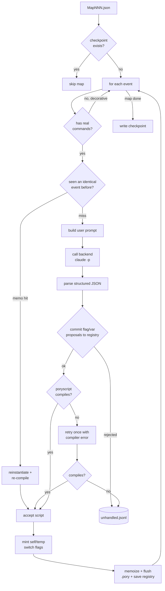

# How the Conversion Process Works — A Walkthrough

**Audience:** humans and the build agent who want to understand, end to end, how
rpg2gba turns one RPG Maker event into compilable Poryscript.

**Scope:** this document focuses on **Phase 4 — the event → Poryscript conversion
agent**, because that's the part with the most moving pieces and the part we're
actively building. The first section situates it inside the whole pipeline so the
walkthrough stands on its own; everything after that is Phase 4.

> If you only read one thing: the conversion process is a **per-event loop** that
> builds a prompt, asks an LLM (the *conversion agent*) for structured JSON,
> validates every flag name through a registry, and refuses to accept any script
> that doesn't compile through `poryscript`. Everything else is plumbing around
> those four moves.

---

## 1. Where this fits: the whole pipeline

Uranium ships as compiled RPG Maker XP / Essentials data. Four converters run
mostly in parallel; their outputs are assembled into a pokeemerald-expansion fork
and built into a ROM.

```
  SOURCE: Pokémon Uranium (RPG Maker XP + Essentials)
  PBS .dat (species/moves/…)   Data/*.rxdata (maps/events)   Graphics/*.png
        │                              │                            │
        ▼                              ▼                            ▼
  ┌──────────────┐            ┌──────────────────┐         ┌──────────────┐
  │ PBS Parser   │            │ rxdata           │         │ Tileset      │
  │ (Phase 2,    │            │ Deserializer     │         │ Converter    │
  │ Python,      │            │ (Phase 3, Ruby   │         │ (Phase 5)    │
  │ deterministic│            │  → JSON)         │         │              │
  └──────┬───────┘            └────────┬─────────┘         └──────┬───────┘
         │                             │                          │
         ▼                             ▼                          ▼
   C data tables             MapNNN.json (events)          Porymap tilesets
   (.h/.c)                          │
                                    ▼
                         ┌────────────────────────┐
                         │  CONVERSION AGENT       │   ◄── THIS DOCUMENT
                         │  (Phase 4, LLM at       │
                         │   runtime + flag        │
                         │   registry + compile    │
                         │   gate)                 │
                         └───────────┬────────────┘
                                     ▼
                              Poryscript (.pory)
                                     │
                                     ▼
              pokeemerald-expansion fork  ──(make)──►  uranium.gba
```

Two things make Phase 4 special:

1. **It's the only stage that uses an LLM at runtime.** PBS and map
   deserialization are deterministic parsers. Event conversion uses an LLM only
   because *naming* (`Switch 42` → `FLAG_RECEIVED_STARTER`) and *idiom matching*
   (12 commands → one `giveitem`) genuinely benefit from it.
2. **There are two different AI agents in this project — don't conflate them.**

| | Build agent (you, in your IDE) | Conversion agent (this doc) |
|---|---|---|
| Lives in | Your editor session | The rpg2gba pipeline, at runtime |
| Reads | `CLAUDE.md`, the whole repo | One event's JSON + the flag registry |
| Writes | Python, Ruby, C, Markdown | Poryscript only |
| Tools | Edit, bash, tests | **None** — pure text in, text out |
| Memory | The conversation | Stateless per call |

The build agent *writes* the conversion agent (its prompts, the orchestrator, the
registry). The conversion agent *runs* inside that machinery, one event at a time,
with no idea the rest of the pipeline exists.

---

## 2. The big picture of the conversion loop

For every map, for every event, the orchestrator runs this loop. The green path
is "it worked"; the red branches are how failure is contained.



Three invariants hold this together (from `CLAUDE.md` §4):

- **Fail loud, not silent.** An event the agent can't handle goes to a queue with
  a reason — it is never dropped or guessed at.
- **One source of truth for names.** Every `FLAG_*` / `VAR_*` passes through the
  registry. The agent *proposes*; the registry *decides*.
- **Idempotent + resumable.** A finished map is skipped on re-run; the `.pory` and
  registry are flushed after every event so a mid-run stop never corrupts state.

---

## 3. The inputs: what an event looks like

Phase 3 deserializes each `.rxdata` map into a `MapNNN.json` file. The unit the
conversion agent sees is a single **event** — an object with an `id`, a position,
and one or more **pages**, each page being a list of raw RPG Maker command codes.

Here is a real-shaped example (an NPC who hands you a Potion):

```json
{
  "id": 4, "name": "EV004", "x": 9, "y": 5,
  "pages": [
    {
      "condition": {"self_switch_valid": false, "self_switch_ch": "A"},
      "list": [
        {"code": 101, "indent": 0, "parameters": ["Here, take this Potion!"]},
        {"code": 355, "indent": 0, "parameters": ["pbReceiveItem(:POTION,1)"]},
        {"code": 123, "indent": 0, "parameters": ["A", 0]},
        {"code": 0,   "indent": 0, "parameters": []}
      ]
    }
  ]
}
```

Key facts about this format that drive the whole design:

- **Commands are numeric codes.** `101` = show text, `123` = control self-switch,
  `201` = transfer player, `355` = a *Script* call, `0` = end of list. The full
  table is `reference/rgss_event_commands.md` (59 codes Uranium actually uses).
- **Uranium adds no new command *codes*.** Almost all of its custom behaviour
  rides inside code `355` *Script* calls as Ruby strings like
  `pbReceiveItem(:POTION,1)` or `pbCallBub(...)`. So the real translation surface
  is "what do these `pbXxx` calls mean," catalogued in
  `reference/uranium_script_calls.md` as MAP / STRIP / UNHANDLED.
- **Self-switches and temp-switches are per-event state, not global flags.**
  Code `123` sets a self-switch (A–D), persistent and local to the event.
  `setTempSwitchOn("A")` (a code-`355` script call) is a *temp*-switch — same
  shape, but it resets every map visit. These need different flag treatment
  (see step 7).

---

## 4. Step-by-step: one event, start to finish

The orchestrator (`src/rpg2gba/conversion_agent/orchestrator.py`) is the driver.
Here's what each step actually does, with the real code.

### Step 0 — Pre-seed / load the flag registry (once per run)

Before any event, the registry is built. It loads hand-authored high-confidence
mappings (`reference/essentials_to_emerald_map.md`) and the Phase 3 sidecars,
which it uses to (a) carry each switch's human label as context, and (b) detect
*script-switches* (`s:`-prefixed runtime checks like `s:pbIsWeekday(...)`) that
must **never** be minted as flags.

```python
reg = FlagRegistry(fork_path=fork_path)
reg.pre_seed(
    REFERENCE_DIR / "essentials_to_emerald_map.md",
    REFERENCE_DIR / "uranium_switches.json",
    REFERENCE_DIR / "uranium_variables.json",
)
# → "pre-seeded 8 flags + 5 vars (34 script-switches blocked)"
```

The registry is **the single source of truth** for flag/var names. The agent will
never write to it directly — it can only *propose*, and the orchestrator commits
the proposal through `propose_flag` / `propose_var`, which validate it.

### Step 1 — Compose the system prompt (once per run, cached)

The prompt is split into two channels by how often it changes
(`prompt_builder.py` + `pipeline._phase4_backend`):

- **System prompt** = the frozen instructions (`prompts/system.md`) **+** the
  event-invariant *static context*: the Poryscript cheatsheet, the Uranium
  script-call reference, and the few-shot examples. This is byte-identical for all
  5,301 events, so it's sent as `claude -p --system-prompt` and hits Anthropic's
  server-side prompt cache instead of being re-billed every time.
- **User prompt** = only the per-event bits (built fresh each event, step 3).

```python
static_context = prompt_builder.build_static_context(
    cheatsheet=prompt_builder.load_cheatsheet(REFERENCE_DIR),
    script_call_ref=prompt_builder.load_script_call_reference(REFERENCE_DIR),
    few_shots=prompt_builder.load_few_shots(),
)
system_prompt = prompt_builder.load_system_prompt() + "\n\n" + static_context
return ClaudeCodeBackend(system_prompt, model=model)  # default claude-sonnet-4-6
```

### Step 2 — Per-map: checkpoint, then per-event triage

```python
def convert_map(self, map_json_path):
    stem = map_json_path.stem               # "Map042"
    if self._checkpoint(stem).exists():     # already done → idempotent skip
        return
    ...
    for event in m["events"]:
        if not _event_has_commands(event):  # decorative / graphic-only → no spawn
            continue
        script = self._convert_event(map_id, event)
        ...
        out_pory.write_text(...)            # flush after EVERY event
        self.registry.save(self.registry_state_path)
```

Two cheap guards run before spending any budget: a **map checkpoint** (skip whole
maps already done) and an **empty-event skip** (decorative events with no real
commands never reach the LLM).

### Step 3 — Build the per-event user prompt

The user message carries only what varies per event: the command-code reference
*sliced to just this event's codes*, the current registry state, and the event
JSON itself.

```python
def _build_prompt(self, payload):
    return prompt_builder.build_user_prompt(
        payload,
        self._registry_state(),
        command_ref=prompt_builder.filter_command_reference(
            self._command_ref, _event_codes(payload)   # only the rows we need
        ),
    )
```

The registry is rendered so the agent knows which names already exist (and must be
reused) and which switch IDs are forbidden script-switches:

```
Already-assigned names (reuse these; do not rename):
- switch 12 -> FLAG_RECEIVED_STARTER
- variable 1 -> VAR_TEMP_POKEMON_CHOICE

Script-switches (Essentials runtime-evaluated — NEVER propose a FLAG_ for these;
queue any conditional that tests them as unhandled): 88, 90, 91, ...
```

### Step 4 — Call the backend (the conversion agent runs)

The primary backend spawns a **fresh, separate `claude` process per event**. That
process *is* the conversion agent — a distinct instance with no tools and no
codebase access, which keeps the two-agent boundary clean. The assembled user
prompt goes in on stdin:

```python
cmd = [
    "claude", "-p",
    "--output-format", "json",
    "--model", self.model,                 # claude-sonnet-4-6 / claude-opus-4-8
    "--system-prompt", self.system_prompt, # cached static context
    "--disallowed-tools", "Bash Edit Write Read Glob Grep WebFetch WebSearch Task",
]
proc = subprocess.run(cmd, input=prompt, capture_output=True, text=True, timeout=600)
```

> An optional `OllamaBackend` implements the same `convert_event()` interface for
> local bulk runs. The orchestrator doesn't care which backend it's talking to —
> that's the whole point of the abstraction.

### Step 5 — Parse the structured response

`claude -p --output-format json` returns an *envelope* `{"result": "...", "usage":
{...}}`. The agent's own answer lives inside `result` and must match a fixed
schema (see `prompts/system.md`):

```json
{
  "script": "<the full Poryscript block as a string>",
  "new_flags": [
    { "switch_id": 42, "name": "FLAG_RECEIVED_STARTER", "reason": "Gives the starter" }
  ],
  "new_vars": [],
  "unhandled": [
    { "command_code": 355, "description": "NuclearMeter.show", "event_id": 3, "page": 1, "line": 7 }
  ]
}
```

`_parse_response` unwraps the envelope (logging cache token counts so we can
confirm caching engaged), then extracts the structured object into a
`ConversionResult{script, new_flags, new_vars, unhandled}`.

### Step 6 — Commit flag/var proposals (the validation gate)

Every proposed name is run through the registry. This is where hallucinated or
junk names die:

```python
def _commit_proposals(self, ctx, result):
    try:
        for f in result.new_flags:
            self.registry.propose_flag(int(f["switch_id"]), f["name"])
        for v in result.new_vars:
            self.registry.propose_var(int(v["var_id"]), v["name"])
    except (RegistryError, KeyError, ValueError) as exc:
        self._queue(ctx, reason=f"bad flag/var proposal: {exc}")
        return False   # → event goes to the unhandled queue
    return True
```

`propose_flag` rejects: script-switches, malformed names, junk/placeholder names
(`FLAG_SWITCH_42`, `FLAG_TODO`), reuse collisions, and **collisions with real
pokeemerald-expansion constants** (it loads the fork's `flags.h`/`vars.h`). A
name only gets accepted if it's new, well-formed, and unique.

### Step 7 — The compile gate (and retry-once)

The accepted script must compile through the real `poryscript` binary before it's
kept. This is the hard quality bar — no script enters the corpus unless the
compiler accepts it.

```python
compiled = self.compile_fn(result.script)
if not compiled.ok:
    retry_prompt = self._retry_prompt(prompt, compiled.stderr)  # feed the error back
    result = self.backend.convert_event(payload, self._registry_state(), retry_prompt)
    ...
    compiled = self.compile_fn(result.script)
    if not compiled.ok:
        self._queue(ctx, reason=f"compile failed twice: {compiled.stderr.strip()}")
        return None
```

The retry prompt literally appends the compiler's error message and asks for
corrected JSON in the same schema. One retry; if it still fails, the event is
queued, not forced.

### Step 8 — Mint the per-event self/temp-switch flags

The agent *emits* names like `FLAG_MAP012_EVENT004_SSA` but never proposes them
(they have no global switch ID). The orchestrator derives them deterministically
from the event and registers them — otherwise they'd be undefined symbols at
assembly.

```python
for letter in sorted(_event_self_switches(event)):   # code 123 + page conditions
    self.registry.mint_self_switch(map_id, event["id"], letter)
for key in sorted(_event_temp_switches(event)):       # setTempSwitchOn(...) code 355/655
    self.registry.mint_temp_switch(map_id, event["id"], key)
```

The two idioms are kept distinct on purpose:

| Idiom | RPG Maker form | Persistence | Flag name | pokeemerald mapping |
|---|---|---|---|---|
| **Self-switch** | code `123`, `"A".."D"` | saved | `FLAG_MAP{m}_EVENT{e}_SS{L}` | saved flag range |
| **Temp-switch** | `setTempSwitchOn("A")` (355) | per-map-visit | `FLAG_MAP{m}_EVENT{e}_TS{L}` | **auto-reset** TEMP flag range |

Getting this wrong was a real bug: temp-switches were being treated as saved
self-switches (wrong persistence) *and* weren't minted at all (undefined symbol).
`setTempSwitchOn` appears 345× across 77 maps — systemic, not a long-tail quirk.

### Step 9 — Memoize, flush, checkpoint

Accepted scripts are memoized so a structurally identical event elsewhere reuses
the result instead of re-spawning the LLM. The `.pory` file and registry state are
flushed after every event; the checkpoint is written when the map finishes.

```python
self._store_memo(key, map_id, event, result)   # dedup C
return result.script
# ... back in convert_map: out_pory written, registry saved, then:
self._checkpoint(stem).write_text("ok\n")
```

---

## 5. A complete worked example

Take the Potion NPC from §3. Here's the whole journey.

**① Input event** (from `MapNNN.json`):

```json
{
  "id": 4, "name": "EV004", "x": 9, "y": 5,
  "pages": [{
    "condition": {"self_switch_valid": false, "self_switch_ch": "A"},
    "list": [
      {"code": 101, "parameters": ["Here, take this Potion!"]},
      {"code": 355, "parameters": ["pbReceiveItem(:POTION,1)"]},
      {"code": 123, "parameters": ["A", 0]},
      {"code": 0,   "parameters": []}
    ]
  }]
}
```

**② What the agent is told** (assembled prompt, abbreviated):

- *System prompt:* "translate one RPG Maker event into Poryscript… output exactly
  this JSON schema…" + cheatsheet + the script-call table (which says
  `pbReceiveItem` → `giveitem`) + few-shot examples.
- *User prompt:* the command-code rows for `101/355/123`, the current registry,
  and the event JSON above.

**③ Agent returns** (structured JSON):

```json
{
  "script": "script Map012_EV004_Page1 {\n    lock\n    faceplayer\n    msgbox(\"Here, take this Potion!\")\n    giveitem(ITEM_POTION, 1)\n    setflag(FLAG_MAP012_EVENT004_SSA)\n    release\n    end\n}\n",
  "new_flags": [],
  "new_vars": [],
  "unhandled": []
}
```

Notice the idiom collapse: four RPG Maker commands became a clean `giveitem` plus
a one-time `setflag` guard, and the terminating `code 0` was dropped.

**④ Orchestrator validates:** no new flags to commit → the script goes to the
compile gate → `poryscript` accepts it → `FLAG_MAP012_EVENT004_SSA` is minted
(self-switch A, derived from code 123) → memoized → appended to `Map012.pory`.

**⑤ Final `.pory` block:**

```
script Map012_EV004_Page1 {
    lock
    faceplayer
    msgbox("Here, take this Potion!")
    giveitem(ITEM_POTION, 1)
    setflag(FLAG_MAP012_EVENT004_SSA)
    release
    end
}
```

And `FLAG_MAP012_EVENT004_SSA` will appear in the generated header (§7) so it
resolves at assembly.

---

## 6. The two failure paths (fail loud, never silent)

Nothing is ever dropped without a record. There are exactly two ways an event
doesn't produce clean script, and both leave a breadcrumb in
`output/uranium-build/unhandled.jsonl`:

1. **The agent flags a command it can't translate.** It emits an `unhandled[]`
   entry (with code, description, location) and a `# UNHANDLED` comment in the
   script. The orchestrator logs each one.
2. **The orchestrator rejects the output** — a bad flag proposal, or a script that
   fails to compile twice. The whole event is queued with the reason.

```jsonl
{"map_id": 31, "event_id": 11, "event_name": "EV011", "reason": "agent-flagged unhandled", "command_code": 201, "description": "warp to map 60 — needs Phase 5 constant"}
{"map_id": 31, "event_id": 11, "event_name": "EV011", "reason": "compile failed twice: line 7: unexpected token"}
```

At the end of a stage, `triage()` summarizes the queue by reason so review is a
counting exercise, not a re-read of every line:

```python
>>> orchestrator.triage(out_dir / "unhandled.jsonl")
{"agent-flagged unhandled": 42, "compile failed twice": 3, "bad flag/var proposal": 1}
```

---

## 7. Common events and the flag header

**Common events** (`common_events.json`) are reusable scripts that maps invoke via
`call CommonEvent_<NNN>` (code 117). They're converted **once, before the maps**,
so every call has a target — otherwise each `call` is a dangling symbol at
assembly. They reuse the same convert core but skip self/temp-switch minting (they
use only global state) and emit a single `CommonEvent_<NNN>` block.

After conversion, `flag_registry.dump_header` writes a C header defining every
name the corpus uses — global flags/vars, self-switches, and temp-switches —
each grouped under a base offset:

```c
#define RPG2GBA_FLAG_BASE       0x500   // TODO Phase 7: free flag range
#define RPG2GBA_SELFSWITCH_BASE 0x600   // TODO Phase 7: free range
#define RPG2GBA_TEMPSWITCH_BASE 0x700   // TODO Phase 7: TEMP (auto-reset) range

#define FLAG_RECEIVED_STARTER        (RPG2GBA_FLAG_BASE + 0)
#define FLAG_MAP012_EVENT004_SSA     (RPG2GBA_SELFSWITCH_BASE + 0)
#define FLAG_MAP002_EVENT011_TSA     (RPG2GBA_TEMPSWITCH_BASE + 0)
```

The base offsets are placeholders that only need to be unique to *assemble*;
Phase 7 assigns real, free, reserved ranges (the temp range must be the engine's
auto-reset-on-warp block so temp-switches keep their semantics).

---

## 8. How to run it

```bash
# Pre-seed the registry + emit the header, report readiness — spends NO budget
python -m rpg2gba.pipeline phase4 --clean

# Convert a single map for debugging (spawns claude per event — SPENDS BUDGET)
python -m rpg2gba.pipeline convert-map --map-id 2 --model claude-sonnet-4-6

# Convert specific common events (debug, partial, no checkpoint)
python -m rpg2gba.pipeline convert-common-events --ce-id 4 --ce-id 5

# Full run: common events first, then every pending map (SPENDS BUDGET)
python -m rpg2gba.pipeline phase4 --run

# Validate the registry state at any time
python -m rpg2gba.conversion_agent.flag_registry validate
```

`--model` is the Sonnet-vs-Opus knob (default `claude-sonnet-4-6`; Opus is
`claude-opus-4-8`). It's ignored by the Ollama backend.

> **Budget + gate reminder:** any `--run` / `convert-map` call spawns one `claude`
> process per event and spends Pro/API budget — confirm with the user first
> (`CLAUDE.md` §10). And before any *bulk* run, the frozen prompt + calibration
> output must pass the §9 #2 manual review gate. Don't push past it on autopilot.

---

## 9. Three optimizations worth knowing (the "dedup" levers)

These don't change *what* gets produced — only how cheaply. All three are built:

- **A — Common-event pass.** Convert the ~22 common events with real commands once
  up front so `call CommonEvent_<NNN>` targets exist (closes a dangling-symbol gap
  in the same class as the self-switch bug).
- **B — Prompt-cache restructure.** Move the event-invariant context (cheatsheet,
  script-call table, few-shots) into the cached system prompt so it isn't re-billed
  on every cold spawn. `claude_code._log_cache_usage` logs `cache_read_input_tokens`
  to confirm the cache engaged.
- **C — Event memoization.** Hash each event with its map/event identity removed;
  a structurally identical event reuses the prior script (rewriting only the
  deterministic self/temp-switch names, then re-running the compile gate as a
  safety check). The memo is fingerprinted by the system prompt and discarded if
  the prompt changes — no cross-prompt reuse.

---

## 10. Source map (where to look)

| Concern | File |
|---|---|
| The driver loop | `src/rpg2gba/conversion_agent/orchestrator.py` |
| Flag/var naming + header emit | `src/rpg2gba/conversion_agent/flag_registry.py` |
| Prompt assembly (static + per-event) | `src/rpg2gba/conversion_agent/prompt_builder.py` |
| The agent's frozen instructions | `src/rpg2gba/conversion_agent/prompts/system.md` |
| Few-shot examples | `src/rpg2gba/conversion_agent/prompts/few_shot/*.md` |
| Primary backend (`claude -p`) | `src/rpg2gba/conversion_agent/backends/claude_code.py` |
| Local backend | `src/rpg2gba/conversion_agent/backends/ollama.py` |
| Compile gate | `src/rpg2gba/conversion_agent/poryscript.py` |
| CLI wiring | `src/rpg2gba/pipeline.py` (`phase4`, `convert-map`, `convert-common-events`) |
| Command-code reference | `reference/rgss_event_commands.md` |
| Uranium script-call dispositions | `reference/uranium_script_calls.md` |
| Registry policy (read before touching it) | `reference/flag_registry_policy.md` |

---

*This is a hand-authored explainer; the code is authoritative. If the two ever
disagree, fix this doc.*
